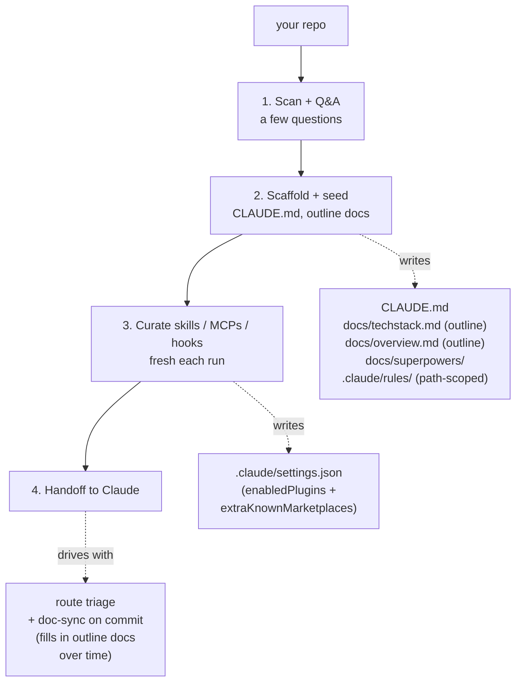

# super-bootstrap

Skip the per-project Claude setup grind. One command picks your skills, writes `CLAUDE.md`, pins your config, **and gives Claude a route-aware workflow** (small tasks stay light; large ones lean on the [superpowers](https://github.com/obra/superpowers) pipeline). Workflow, not just a toolbelt.

## Best for

Solo devs juggling multiple repos.

**Repo needs at least one of:**
- a manifest (`package.json` / `pyproject.toml` / `Cargo.toml` / etc.),
- source files in any language, or
- a README that describes the product / deps / structure.

Doc-only repos are fine if intent and shape are clear. Pure greenfield (empty repo, no plan written yet) is out of scope — sketch a brief README first, or run a product-ideation skill before this one.

**How picks are chosen:** matched to your detected stack + workflow tools, deduped across sources with provenance, labeled by trust signal (Anthropic-vetted / popular / fresh / unaudited).

## Install

In Claude Code:

```
/plugin marketplace add rockyhong/super-bootstrap
/plugin install super-bootstrap@super-bootstrap
```

## How it works

Run it:

```
/super-bootstrap
```

Then it walks these phases:

1. **Scan + Q&A** — detects your stack, confirms with a few questions. Stops if the repo is empty.
2. **Scaffold** — writes `CLAUDE.md` and outline `docs/techstack.md` + `docs/overview.md` from what was detected.
3. **Curate** — picks skills / MCPs / hooks for your stack. Re-run refreshes against live sources.
4. **Handoff** — Claude routes by task size: small → implement, medium → quick brainstorm, large → full [superpowers](https://github.com/obra/superpowers) pipeline. Doc-sync runs on every commit, filling in the outline docs.

Commits the scaffold. Re-run any time.



## How files are handled

| Path | Behavior |
|---|---|
| `CLAUDE.md` | **Layered** per-section — never overwritten. Diff shown before any write. |
| `.claude/settings.json` | **Merged** — adds `enabledPlugins` + `extraKnownMarketplaces`; your other settings preserved. |
| `docs/`, `.claude/rules/` | **Seeded** with new files from detected stack. User-grown content never touched on re-run. |
| `.env*`, `*.key`, `*credential*` | **Skipped** from scan entirely — never read, never written. |

Bundles `/todo` (active work scanner) and `/commit` (session-isolated, doc-sync-gated, conventional, no push), so a fresh clone gets the same setup.

## Sources

| Tool | Role |
|---|---|
| [superpowers](https://github.com/obra/superpowers) | Workflow pipeline (brainstorm → spec → plan → execute) baked into the CLAUDE.md |
| [andrej-karpathy-skills](https://github.com/forrestchang/andrej-karpathy-skills) | Source of the Coding Principles section in the scaffolded CLAUDE.md (Karpathy-derived guardrails) |
| [claude-code-setup](https://claude.com/plugins/claude-code-setup) | Anthropic's plugin recommender — fast-path source if installed |
| [Anthropic plugin marketplace](https://claude.com/plugins) | Anthropic-vetted skills, MCPs, hooks, subagents |
| [modelcontextprotocol/registry](https://github.com/modelcontextprotocol/registry) | Official MCP discovery registry — indexes reference impls + community |
| [everything-claude-code (ECC)](https://github.com/affaan-m/everything-claude-code) | Component bundle (skills + agents + rules + hooks). Phase 3b prefers ECC's language-specific rules over local skeletons. |
| [awesome-claude-skills](https://github.com/ComposioHQ/awesome-claude-skills) | Curated category index, strong on workflow / external-tools picks |
| [VoltAgent/awesome-agent-skills](https://github.com/VoltAgent/awesome-agent-skills) | 1000+ skills from official dev teams (Anthropic, Vercel, Stripe, Cloudflare) + community |
| [Jeffallan/claude-skills](https://github.com/Jeffallan/claude-skills) | Fullstack-skills marketplace |

## License

MIT
