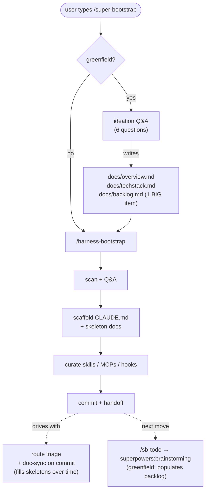

# super-bootstrap


Skip the per-project Claude setup grind. One command picks your skills, writes `CLAUDE.md`, pins your config, **and gives Claude a route-aware workflow** (small tasks stay light; large ones lean on the [superpowers](https://github.com/obra/superpowers) pipeline). Workflow, not just a toolbelt.

## Best for

Solo devs juggling multiple repos.

**Two paths, one entry:**
- **Pre-existing repo** (has manifest, source files, or descriptive README) → `/super-bootstrap` detects code, dispatches to `/harness-bootstrap` which scaffolds the harness.
- **Greenfield** (empty repo, no plan yet) → `/super-bootstrap` runs lean ideation Q&A (~6 questions), seeds `overview.md` + `techstack.md` + `backlog.md` (with one big roadmap item), then dispatches to `/harness-bootstrap`.

Doc-only repos with clear intent skip ideation. Truly empty repos enter ideation. The gate auto-routes — you only ever type `/super-bootstrap`.

**How picks are chosen:** matched to your detected stack + workflow tools, deduped across sources with provenance, labeled by trust signal (Anthropic-vetted / popular / fresh / unaudited).

## Install

In Claude Code:

```
/plugin marketplace add rockyhong/super-bootstrap
/plugin install super-bootstrap@super-bootstrap
```

## How it works

Run it:

```
/super-bootstrap
```

`/super-bootstrap` is the gate. It detects greenfield vs. pre-existing and routes:

**Pre-existing repo** — dispatches to `/harness-bootstrap` immediately. Harness walks:

1. **Scan + Q&A** — detects stack, confirms with a few questions.
2. **Scaffold** — writes `CLAUDE.md` and skeleton `docs/techstack.md` + `docs/overview.md`.
3. **Curate** — picks skills / MCPs / hooks for your stack. Re-run refreshes against live sources.
4. **Handoff** — Claude routes by task size: small → implement, medium → quick brainstorm, large → full [superpowers](https://github.com/obra/superpowers) pipeline. Doc-sync runs on every commit, filling skeleton docs.

**Greenfield** — `/super-bootstrap` runs ideation first (~6 questions: problem / user / stack-pick from 2-3 LLM-proposed options / external-tools / optional distribution + ICP), writes `docs/overview.md` + `docs/techstack.md` + `docs/backlog.md` (with one BIG roadmap item), then dispatches to `/harness-bootstrap`. After harness lives, `/sb-todo` shows the BIG item; running `superpowers:brainstorming` populates the backlog with feature breakdown + first-feature spec + plan.

Commits scaffold output. Re-run any time — `/harness-bootstrap` directly skips the gate.



## Skills shipped

| Skill | What it does |
|---|---|
| `/super-bootstrap` | Public entry. Detects greenfield, runs ideation Q&A if so, then dispatches to `/harness-bootstrap`. |
| `/harness-bootstrap` | Installs the harness — CLAUDE.md, skeleton docs, path-scoped rules, curated picks. |
| `/sb-commit` | Session-isolated, doc-sync-gated commit. No push. |
| `/sb-todo` | Active-work scanner — reads `docs/superpowers/specs+plans/` and `docs/backlog.md`. |

## How files are handled

| Path | Behavior |
|---|---|
| `CLAUDE.md` | **Layered** per-section — never overwritten. Diff shown before any write. |
| `.claude/settings.json` | **Merged** — adds `enabledPlugins` + `extraKnownMarketplaces`; your other settings preserved. |
| `docs/`, `.claude/rules/` | **Seeded** with new files from detected stack. User-grown content never touched on re-run. |
| `.env*`, `*.key`, `*credential*` | **Skipped** from scan entirely — never read, never written. |

Bundles `/sb-todo` (active-work scanner) and `/sb-commit` (session-isolated, doc-sync-gated, conventional, no push), so a fresh clone of any bootstrapped repo invokes the same namespaced commands. Names are prefixed to avoid collision with other plugins (e.g. `commit-commands:commit`).

## Sources

| Tool | Role |
|---|---|
| [superpowers](https://github.com/obra/superpowers) | Workflow pipeline (brainstorm → spec → plan → execute) baked into the CLAUDE.md |
| [andrej-karpathy-skills](https://github.com/forrestchang/andrej-karpathy-skills) | Source of the Coding Principles section in the scaffolded CLAUDE.md (Karpathy-derived guardrails) |
| [claude-code-setup](https://claude.com/plugins/claude-code-setup) | Anthropic's plugin recommender — fast-path source if installed |
| [Anthropic plugin marketplace](https://claude.com/plugins) | Anthropic-vetted skills, MCPs, hooks, subagents |
| [modelcontextprotocol/registry](https://github.com/modelcontextprotocol/registry) | Official MCP discovery registry — indexes reference impls + community |
| [everything-claude-code (ECC)](https://github.com/affaan-m/everything-claude-code) | Component bundle (skills + agents + rules + hooks). Phase 3b prefers ECC's language-specific rules over local skeletons. |
| [awesome-claude-skills](https://github.com/ComposioHQ/awesome-claude-skills) | Curated category index, strong on workflow / external-tools picks |
| [VoltAgent/awesome-agent-skills](https://github.com/VoltAgent/awesome-agent-skills) | 1000+ skills from official dev teams (Anthropic, Vercel, Stripe, Cloudflare) + community |
| [Jeffallan/claude-skills](https://github.com/Jeffallan/claude-skills) | Fullstack-skills marketplace |

## License

MIT
