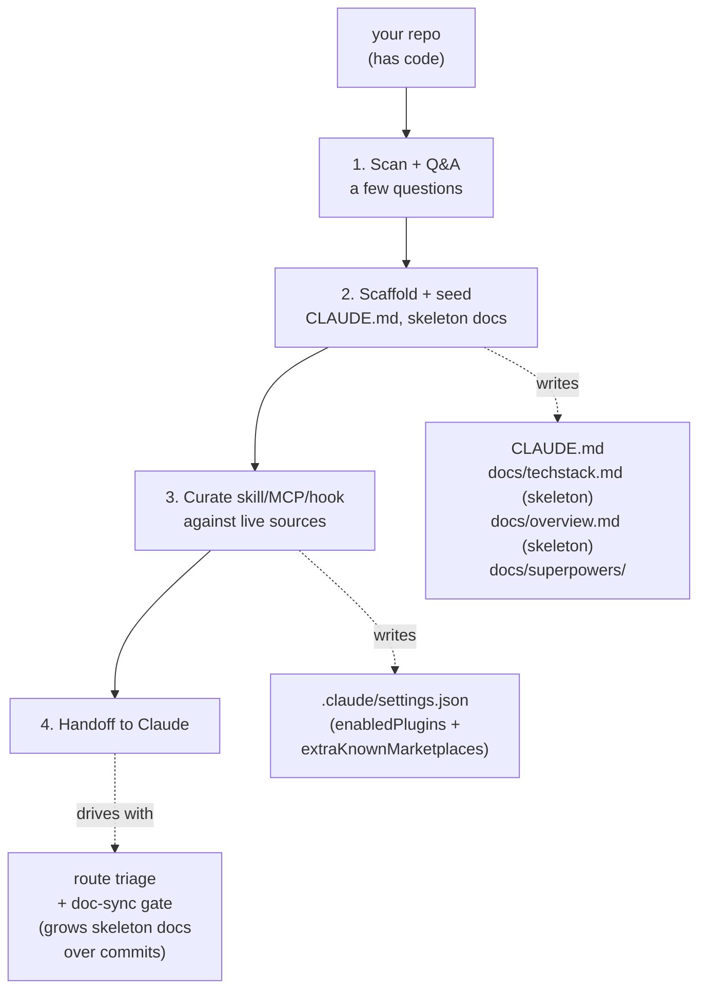

# super-bootstrap

Skip the per-project Claude setup grind. One command picks your skills, writes `CLAUDE.md`, pins your config, **and gives Claude a route-aware workflow** (small tasks stay light; large ones lean on the [superpowers](https://github.com/obra/superpowers) pipeline). Workflow, not just a toolbelt.

## Install

In Claude Code:

```
/plugin marketplace add rockyhong/super-bootstrap
/plugin install super-bootstrap@super-bootstrap
```

## How it works

Run in any repo with code:

```
/super-bootstrap
```

Then it walks these phases:

1. **Scan + Q&A** — detects stack, asks a few questions to confirm. Aborts if true greenfield (no code) — see Scope.
2. **Scaffold** — writes `CLAUDE.md`, seeds skeleton `docs/techstack.md` + `docs/overview.md` with detected facts, drops in pipeline workspace
3. **Curate** — picks skills / MCPs / hooks matched to your stack + workflow tools, with trust signals per pick. Pinned in `.claude/settings.json`. Runs every `/super-bootstrap` to refresh against live source updates
4. **Handoff** — Claude routes by task size: small → direct implement, medium → quick brainstorm, large → full [superpowers](https://github.com/obra/superpowers) pipeline (brainstorm → spec → plan → execute). Doc-sync gate fires on every commit, growing the skeleton docs and blocking stale-doc commits

Commits the scaffold. Re-run anytime to refresh picks and sync drift.



## What it touches

- **`CLAUDE.md`** — layered, not overwritten. Pipeline sections added or synced; your existing sections untouched. Per-section diff shown before every write.
- **`docs/techstack.md`** — seeded as a skeleton with detected runtime / framework / build commands. Architecture rules / coding patterns grow via doc-sync over commits.
- **`docs/overview.md`** — seeded as a skeleton with Q&A answers (problem / user / current state). Module index / data flow / key boundaries grow via doc-sync over commits.
- **`.claude/settings.json`** — merges `enabledPlugins` + `extraKnownMarketplaces`. Other settings preserved. Picks delta'd against live sources on every re-run.
- **`.claude/` plugin cache** — lands next session when Claude Code auto-resolves the new plugins.
- **`docs/superpowers/{specs,plans}/`** — pipeline workspace. `/todo` (bundled) scans this for active work.
- **`docs/specs/`** *(adaptive)* — persistent feature specs, scaffolded if you opt in during Q&A.
- **`docs/backlog.md`** *(adaptive)* — single tracker for deferred BUG/DEBT/GAP items, scaffolded if you opt in.

Plugin also bundles `/todo` (active work scanner) and `/commit` (session-isolated, doc-sync-gated, conventional, no push). Both encode the harness rules so the handoff isn't broken on fresh machines.

## Scope

**For projects with code.** Super-bootstrap installs **harness** (workflow + doc-sync + skill picks + skeleton docs), not **product**. Phase 1 detects manifests, source files, and README — needs at least one to scaffold against.

**True greenfield (empty repo, product still in ideation) is out of scope.** A friendly gate aborts and asks you to add at least a manifest, an entry-point file, or a brief README first. Use a product-ideation skill / plugin for empty-repo work; super-bootstrap kicks in once code exists.

Best for solo devs juggling multiple repos who want quick Claude bootstrap per project. Supports a wide range of stacks — picks pulled from Anthropic's marketplace, awesome-skills, tonsofskills, and mcpmarket, matched to your detected stack and workflow tools. Sensitive files (`.env*`, `*.key`, `*credential*`, etc.) skipped from scan.

## References

| Tool | Role |
|---|---|
| [superpowers](https://github.com/obra/superpowers) | Workflow pipeline (brainstorm → spec → plan → execute) baked into the CLAUDE.md |
| [andrej-karpathy-skills](https://github.com/forrestchang/andrej-karpathy-skills) | Source of the Coding Principles section in the scaffolded CLAUDE.md (Karpathy-derived guardrails) |
| [claude-code-setup](https://claude.com/plugins/claude-code-setup) | Anthropic's plugin recommender — fast-path source if installed |
| [Anthropic plugin marketplace](https://claude.com/plugins) | Vetted skills, MCPs, hooks, subagents |
| [awesome-skills](https://awesome-skills.com) | Community skill catalog |
| [tonsofskills](https://tonsofskills.com) | Community skill catalog (`ccpi` CLI) |
| [mcpmarket](https://mcpmarket.com) | MCP server catalog |

## License

MIT
