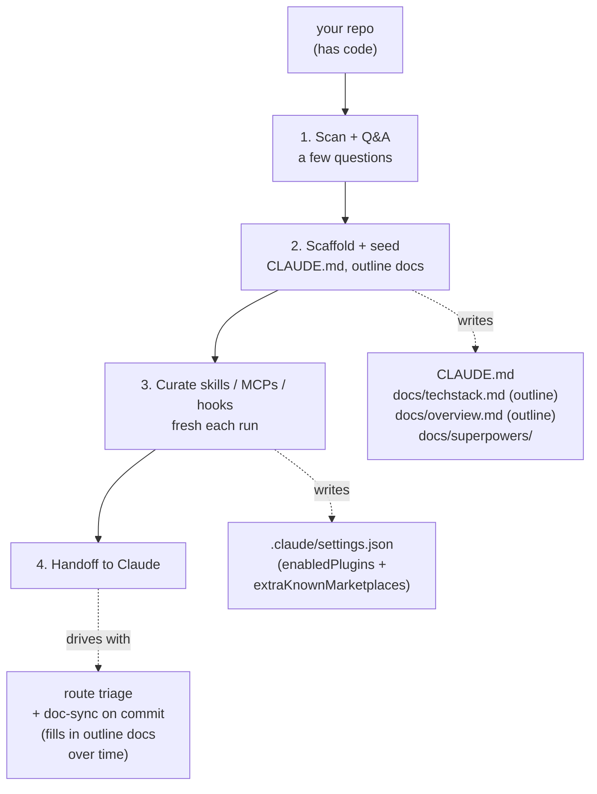

# super-bootstrap

Skip the per-project Claude setup grind. One command picks your skills, writes `CLAUDE.md`, pins your config, **and gives Claude a route-aware workflow** (small tasks stay light; large ones lean on the [superpowers](https://github.com/obra/superpowers) pipeline). Workflow, not just a toolbelt.

## Install

In Claude Code:

```
/plugin marketplace add rockyhong/super-bootstrap
/plugin install super-bootstrap@super-bootstrap
```

## How it works

Run in any repo with code:

```
/super-bootstrap
```

Then it walks these phases:

1. **Scan + Q&A** — detects your stack, confirms with a few questions. Stops if the repo is empty.
2. **Scaffold** — writes `CLAUDE.md` and outline `docs/techstack.md` + `docs/overview.md` from what was detected.
3. **Curate** — picks skills / MCPs / hooks for your stack, trust signal per pick. Re-run to refresh.
4. **Handoff** — Claude routes by task size: small → implement, medium → quick brainstorm, large → full [superpowers](https://github.com/obra/superpowers) pipeline. Doc-sync runs on every commit, filling in the outline docs.

Commits the scaffold. Re-run any time.



## What it touches

- **`CLAUDE.md`** — layered, not overwritten. Per-section diff before every write.
- **`docs/techstack.md`** — outline from detected runtime / framework / build. Rules + patterns fill in over commits.
- **`docs/overview.md`** — outline from your Q&A (problem / user / current state). Module index + data flow fill in over commits.
- **`.claude/settings.json`** — merges `enabledPlugins` + `extraKnownMarketplaces`. Other settings preserved.
- **`.claude/` plugin cache** — lands next session when Claude Code resolves the new plugins.
- **`docs/superpowers/{specs,plans}/`** — pipeline workspace. `/todo` scans this for active work.
- **`docs/specs/`** *(adaptive)* — persistent feature specs, opt-in during Q&A.
- **`docs/backlog.md`** *(adaptive)* — BUG/DEBT/GAP tracker, opt-in.

Bundles `/todo` (active work scanner) and `/commit` (session-isolated, doc-sync-gated, conventional, no push), so a fresh clone gets the same setup.

## Scope

**Needs code in the repo** — a manifest, a source file, or a README. Empty repos: come back once you've written something. For brand-new ideation, use a product-ideation skill first.

Best for solo devs juggling multiple repos. Wide stack support — picks pulled from Anthropic's marketplace, awesome-skills, tonsofskills, and mcpmarket, matched to your stack and tools. Sensitive files (`.env*`, `*.key`, `*credential*`) skipped from scan.

## References

| Tool | Role |
|---|---|
| [superpowers](https://github.com/obra/superpowers) | Workflow pipeline (brainstorm → spec → plan → execute) baked into the CLAUDE.md |
| [andrej-karpathy-skills](https://github.com/forrestchang/andrej-karpathy-skills) | Source of the Coding Principles section in the scaffolded CLAUDE.md (Karpathy-derived guardrails) |
| [claude-code-setup](https://claude.com/plugins/claude-code-setup) | Anthropic's plugin recommender — fast-path source if installed |
| [Anthropic plugin marketplace](https://claude.com/plugins) | Vetted skills, MCPs, hooks, subagents |
| [awesome-skills](https://awesome-skills.com) | Community skill catalog |
| [tonsofskills](https://tonsofskills.com) | Community skill catalog (`ccpi` CLI) |
| [mcpmarket](https://mcpmarket.com) | MCP server catalog |

## License

MIT
