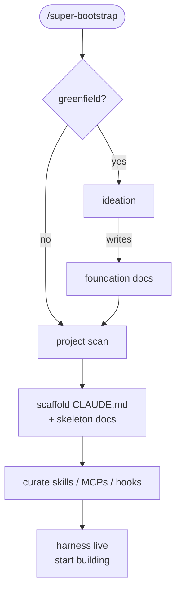

# super-bootstrap


Skip the per-project Claude setup grind. One command picks your skills, writes `CLAUDE.md`, pins your config, **and gives Claude a phase-gated workflow** — every session runs the [superpowers](https://github.com/obra/superpowers) pipeline, but only the phases the work actually needs. Workflow, not just a toolbelt.

## Best for

Solo devs juggling multiple repos.

## Install

In Claude Code:

```
/plugin marketplace add rockyhong/super-bootstrap
/plugin install super-bootstrap@super-bootstrap
```

## Use

```
/super-bootstrap
```

One command per repo. Auto-routes:

- **Pre-existing repo** → scans stack, asks a few clarifying Qs, scaffolds `CLAUDE.md` + docs, curates skills / MCPs / hooks.
- **Greenfield** → lean ideation Q&A seeds foundation docs with first move queued, then scaffolds the harness.

Picks are matched to your stack and labeled by trust signal (Anthropic-vetted / popular / fresh / unaudited).



Re-run any time — incremental, never overwrites your edits.

## How files are handled

| Path | Behavior |
|---|---|
| `CLAUDE.md` | **Layered** per-section — never overwritten. Diff shown before any write. |
| `.claude/settings.json` | **Merged** — adds `enabledPlugins` + `extraKnownMarketplaces`; your other settings preserved. |
| `docs/`, `.claude/rules/` | **Seeded** with new files from detected stack. User-grown content never touched on re-run. |
| `.claude/hooks/` | **Installed** by default — four hook assets: `docsync-gate` (PreToolUse) blocks `git commit` until this session's doc-sync scan has run (token is session-scoped + 30-min TTL; drain-managed worktrees under `.claude/worktrees/` pass through); `docsync-scan` enumerates the doc-sync surface and self-stamps the gate token by running; `harness-grounding` injects a grounding checklist on harness-file edits, never blocks; `entry-nudge` (UserPromptSubmit) injects a one-line card-grounded-entry pointer on every prompt, never blocks. |
| `.claude/super-bootstrap-runway.json` | **Version-stamped** — records the plugin version that scaffolded/synced this runway. On re-run a stale or missing stamp forces a full drift re-check (no "looks current" skim). |
| `.env*`, `*.key`, `*credential*` | **Skipped** from scan entirely — never read, never written. |

Also bundles `/super-bootstrap:todo` (intent-filtered work board), `/super-bootstrap:log` (capture observations into the backlog), `/super-bootstrap:commit` (session-isolated, doc-sync-gated), `/super-bootstrap:merge` (absorb feature branches; aborts + surfaces on conflict), and `/super-bootstrap:help` (index of installed user-invoke skills) — all namespaced under `super-bootstrap:` so plugin manager disambiguates collisions automatically. The `/super-bootstrap` entry stays bare (plugin-name == skill-name special case).

Optional bonus: `/super-bootstrap:release-init` — one-shot scaffolder. Detects project type (unity / tauri / node / ios-native / android-native / generic) and generates a tailored `/release` skill at `.claude/skills/release/SKILL.md` (project-level skill, bare invocation since it lives in the user's repo, not under this plugin's namespace). Run only on repos that ship versioned releases.

## Sources

| Tool | Role |
|---|---|
| [superpowers](https://github.com/obra/superpowers) | Workflow entries the CLAUDE.md routes into per work cluster — `systematic-debugging` for bugs, `brainstorming` for fuzzy features, `writing-plans` for design-intact multi-step |
| [andrej-karpathy-skills](https://github.com/forrestchang/andrej-karpathy-skills) | Core dep auto-pinned in `.claude/settings.json`. Scaffolded CLAUDE.md § Coding Principles invokes its `karpathy-guidelines` skill before every code edit (think-before-coding, simplicity, surgical changes, goal-driven execution). |
| [claude-code-setup](https://claude.com/plugins/claude-code-setup) | Anthropic's plugin recommender — fast-path source if installed |
| [Anthropic plugin marketplace](https://claude.com/plugins) | Anthropic-vetted skills, MCPs, hooks, subagents |
| [modelcontextprotocol/registry](https://github.com/modelcontextprotocol/registry) | Official MCP discovery registry — indexes reference impls + community |
| [everything-claude-code (ECC)](https://github.com/affaan-m/everything-claude-code) | Component bundle (skills + agents + rules + hooks). Language-specific rules preferred over local skeletons. |
| [awesome-claude-skills](https://github.com/ComposioHQ/awesome-claude-skills) | Curated category index, strong on workflow / external-tools picks |
| [VoltAgent/awesome-agent-skills](https://github.com/VoltAgent/awesome-agent-skills) | 1000+ skills from official dev teams (Anthropic, Vercel, Stripe, Cloudflare) + community |

## License

MIT
