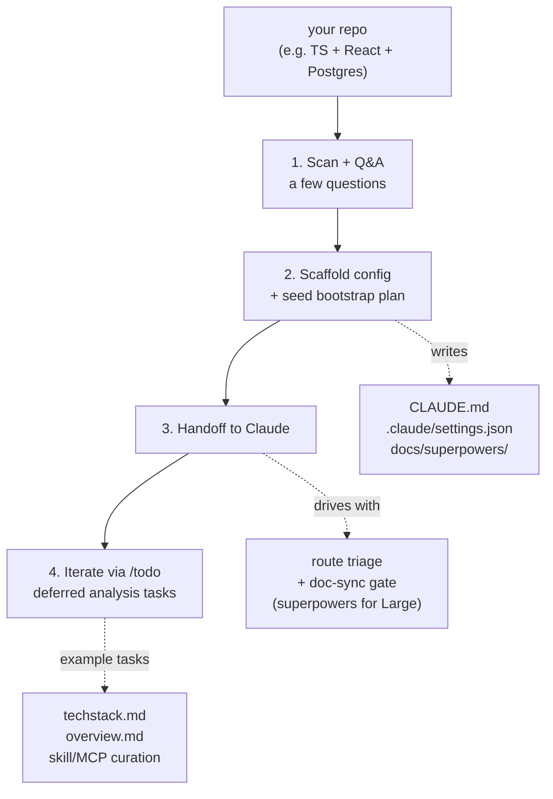

# super-bootstrap

Skip the per-project Claude setup grind. One command picks your skills, writes `CLAUDE.md`, pins your config, **and gives Claude a route-aware workflow** (small tasks stay light; large ones lean on the [superpowers](https://github.com/obra/superpowers) pipeline). Workflow, not just a toolbelt.

## Install

In Claude Code:

```
/plugin marketplace add rockyhong/super-bootstrap
/plugin install super-bootstrap@super-bootstrap
```

## How it works

Run in any repo:

```
/super-bootstrap
```

Then it walks these phases:

1. **Scan + Q&A** — detects stack, asks a few questions to confirm
2. **Scaffold** — writes `CLAUDE.md`, pins config, drops in pipeline workspace, seeds a bootstrap plan with deferred analysis tasks
3. **Handoff** — Claude routes by task size: small → direct implement, medium → quick brainstorm, large → full [superpowers](https://github.com/obra/superpowers) pipeline (brainstorm → spec → plan → execute). Doc-sync gate fires on every commit regardless of route, blocking stale-doc commits
4. **Iterate** — `/todo` walks the bootstrap plan one session at a time: techstack deep-dive, product overview, skill/MCP curation, etc. Each task is session-sized, so context stays clean.

Commits the scaffold. Re-run anytime to sync drift.



## What it touches

- **`CLAUDE.md`** — layered, not overwritten. Pipeline sections added or synced; your existing sections untouched. Per-section diff shown before every write.
- **`.claude/settings.json`** — merges `enabledPlugins` + `extraKnownMarketplaces`. Other settings preserved.
- **`.claude/` plugin cache** — lands next session when Claude Code auto-resolves the new plugins.
- **`docs/superpowers/{specs,plans}/`** — new pipeline workspace. `/todo` skill (bundled) scans this for active work.
- **`docs/backlog.md`** *(adaptive)* — single tracker for deferred BUG/DEBT/GAP items, scaffolded if you opt in during Q&A.

Plugin also bundles `/todo` (active work scanner) and `/commit` (session-isolated, doc-sync-gated, conventional, no push). Both encode the harness rules so the handoff isn't broken on fresh machines.

## Scope

Best for solo devs juggling multiple repos who want quick Claude bootstrap per project.

Supports a wide range of stacks — picks pulled from Anthropic's marketplace, awesome-skills, tonsofskills, and mcpmarket, matched to your detected stack. Sensitive files (`.env*`, `*.key`, `*credential*`, etc.) skipped from scan.

## References

| Tool | Role |
|---|---|
| [superpowers](https://github.com/obra/superpowers) | Workflow pipeline (brainstorm → spec → plan → execute) baked into the CLAUDE.md |
| [andrej-karpathy-skills](https://github.com/forrestchang/andrej-karpathy-skills) | Source of the Coding Principles section in the scaffolded CLAUDE.md (Karpathy-derived guardrails) |
| [claude-code-setup](https://claude.com/plugins/claude-code-setup) | Anthropic's plugin recommender — fast-path source if installed |
| [Anthropic plugin marketplace](https://claude.com/plugins) | Vetted skills, MCPs, hooks, subagents |
| [awesome-skills](https://awesome-skills.com) | Community skill catalog |
| [tonsofskills](https://tonsofskills.com) | Community skill catalog (`ccpi` CLI) |
| [mcpmarket](https://mcpmarket.com) | MCP server catalog |

## License

MIT
