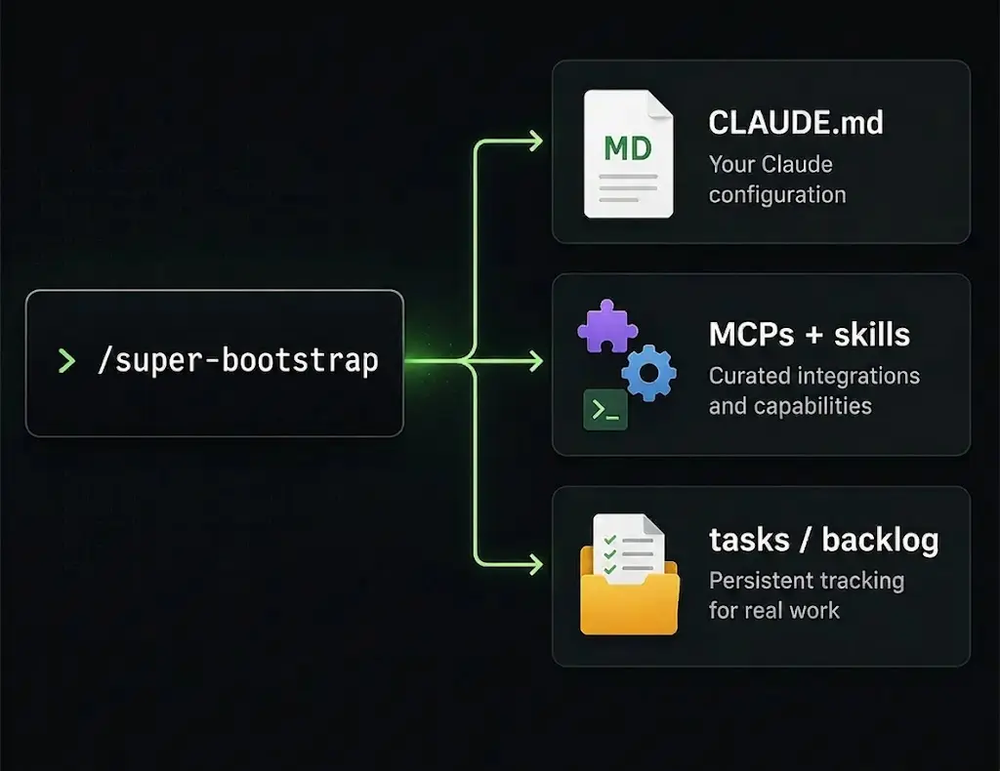

# super-bootstrap



Skip the per-project Claude setup grind. One command picks your skills, writes `CLAUDE.md`, pins your config, **and gives Claude a route-aware workflow** (small tasks stay light; large ones lean on the [superpowers](https://github.com/obra/superpowers) pipeline). Workflow, not just a toolbelt.

## Best for

Solo devs juggling multiple repos.

## Install

In Claude Code:

```
/plugin marketplace add rockyhong/super-bootstrap
/plugin install super-bootstrap@super-bootstrap
```

## Use

```
/super-bootstrap
```

One command per repo. Auto-routes:

- **Repo with code** → scans your stack, asks a few clarifying Qs, scaffolds `CLAUDE.md` + docs, picks skills / MCPs / hooks.
- **Empty repo** → ~6 ideation Qs (problem / user / stack / tools), seeds foundation docs with first move queued, then scaffolds the harness.

Picks are matched to your stack and labeled by trust signal (Anthropic-vetted / popular / fresh / unaudited).


Re-run any time — incremental, never overwrites your edits.

## What gets touched

| Path | Behavior |
|---|---|
| `CLAUDE.md` | **Layered** per-section — never overwritten. Diff shown before any write. |
| `.claude/settings.json` | **Merged** — adds `enabledPlugins` + `extraKnownMarketplaces`; your other settings preserved. |
| `docs/`, `.claude/rules/` | **Seeded** with new files from detected stack. User-grown content never touched on re-run. |
| `.env*`, `*.key`, `*credential*` | **Skipped** from scan entirely — never read, never written. |

Also bundles `/sb-todo` (active-work scanner) and `/sb-commit` (session-isolated, doc-sync-gated, no push) — namespaced to avoid collision with other plugins.

## Sources

| Tool | Role |
|---|---|
| [superpowers](https://github.com/obra/superpowers) | Workflow pipeline (brainstorm → spec → plan → execute) baked into the CLAUDE.md |
| [andrej-karpathy-skills](https://github.com/forrestchang/andrej-karpathy-skills) | Source of the Coding Principles section in the scaffolded CLAUDE.md (Karpathy-derived guardrails) |
| [claude-code-setup](https://claude.com/plugins/claude-code-setup) | Anthropic's plugin recommender — fast-path source if installed |
| [Anthropic plugin marketplace](https://claude.com/plugins) | Anthropic-vetted skills, MCPs, hooks, subagents |
| [modelcontextprotocol/registry](https://github.com/modelcontextprotocol/registry) | Official MCP discovery registry — indexes reference impls + community |
| [everything-claude-code (ECC)](https://github.com/affaan-m/everything-claude-code) | Component bundle (skills + agents + rules + hooks). Language-specific rules preferred over local skeletons. |
| [awesome-claude-skills](https://github.com/ComposioHQ/awesome-claude-skills) | Curated category index, strong on workflow / external-tools picks |
| [VoltAgent/awesome-agent-skills](https://github.com/VoltAgent/awesome-agent-skills) | 1000+ skills from official dev teams (Anthropic, Vercel, Stripe, Cloudflare) + community |
| [Jeffallan/claude-skills](https://github.com/Jeffallan/claude-skills) | Fullstack-skills marketplace |

## License

MIT
