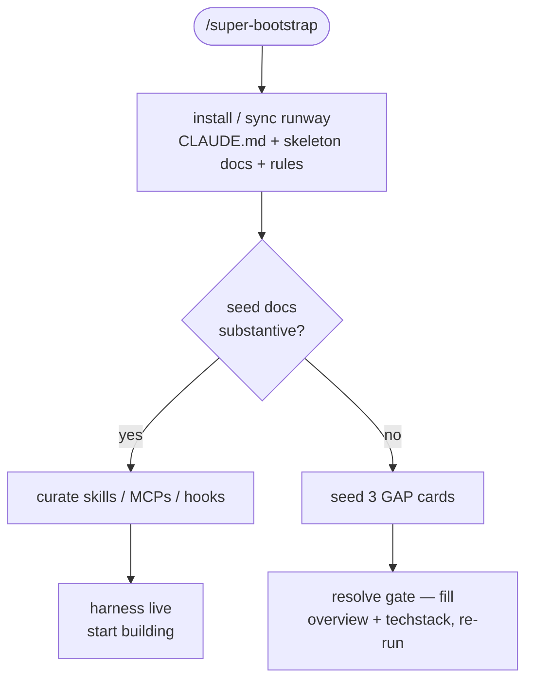

# super-bootstrap


Skip the per-project Claude setup grind. One command picks your skills, writes `CLAUDE.md`, pins your config, **and gives Claude a phase-gated workflow** — every session runs the pipeline, but only the phases the work actually needs. Workflow, not just a toolbelt. The harness [names disciplines, not skills](docs/specs/harness-architecture.md#6-decided-vs-open), so it does not marry you to any one process-harness plugin.

## Best for

Solo devs juggling multiple repos — agentic builders, not just coders. The harness carries
product context (problem, user, gap cards) alongside the engineering pipeline, because a
[codebase answers *solution* only](docs/overview.md#user).

## Install

In Claude Code:

```
/plugin marketplace add rockyhong/super-bootstrap
/plugin install super-bootstrap@super-bootstrap
```

## Use

```
/super-bootstrap
```

One command per repo. Auto-routes:

The runway installs or syncs first either way — [no product Q&A at any point](docs/overview.md#problem). What follows depends on whether the seed docs already carry product content:

- **Seed docs substantive** → curates skills / MCPs / hooks against the stack those docs already declare.
- **Seed docs unfilled (greenfield)** → seeds three GAP cards (overview, techstack, tech curation) and stops at the resolve gate; curation waits until the product is settled.

Picks are matched to your stack and labeled by trust signal (Anthropic-vetted / popular / fresh / unaudited).


```mermaid
flowchart TD
    entry(["/super-bootstrap"])
    entry --> runway["install / sync runway<br/>CLAUDE.md + skeleton docs + rules"]
    runway --> gate{"seed docs<br/>substantive?"}
    gate -->|yes| curate["curate skills / MCPs / hooks"]
    gate -->|no| cards["seed 3 GAP cards"]
    cards --> hold["resolve gate — fill<br/>overview + techstack, re-run"]
    curate --> done["harness live<br/>start building"]
```

Re-run any time — incremental, never overwrites your edits. A re-run also retires consumer fork skills/agents the plugin now supersedes (per-deletion confirm) and backfills runway sections added since the last sync. A workspace manifest (`pnpm-workspace.yaml`, `turbo.json`, …) switches on the monorepo tier — rules and build pre-flight fan out per package. Repos whose card set outgrows one flat list can opt into the scale module (`docs/parked.md` + `docs/test-queue.md` + `docs/outward.md` + a venue-map rule) — offered only once earned, never by default.

## How files are handled

| Path | Behavior |
|---|---|
| `CLAUDE.md` | **Layered** per-section — never overwritten. Diff shown before any write. |
| `.claude/settings.json` | **Merged** — adds `enabledPlugins` + `extraKnownMarketplaces` for two pin classes: the core self-pin and the [paired `mattpocock-skills` pin](docs/techstack.md#key-dependencies) (drop it by setting its value to `false` — deleting the key re-seeds it on the next sync); your other settings preserved. |
| `CODING_STANDARDS.md` | **Seeded** headings-only at the repo root — preamble + section headings drift-checked on re-run, section content is yours and fills via doc-sync. |
| `docs/`, `.claude/rules/` | **Seeded** with new files from detected stack. User-grown content never touched on re-run. |
| `.claude/hooks/` | **Installed** by default — three hook assets: `commit-channel` (PreToolUse) confines raw `git commit` to the main-session commit door — worker subagents are routed back to `/super-bootstrap:commit`, which runs commit mechanics gateway-inline, runs a bundled link-integrity check every commit, and dispatches a cold doc-sync scan on a grep, declared-citer, or link-target hit and a premise-closure judge on a product-anchor hit. The `consult-check` pair (SessionStart + UserPromptSubmit) derives a compact `docs/**` catalog once per session and injects a forced per-doc relevance evaluation at every prompt — the read boundary's activation layer. |
| `.claude/super-bootstrap-runway.json` | **Coverage receipt** — records the plugin version that scaffolded/synced this runway plus which sections that sync actually checked — compared, or proposed for insert (`covered` / `declined`). On re-run a stale or missing stamp — or a matching version with coverage gaps — forces a full drift re-check (no "looks current" skim). |
| `.env*`, `*.key`, `*credential*` | **Skipped** from scan entirely — never read, never written. |

## Day to day

The runway's doors are bundled skills — all namespaced `super-bootstrap:` so the plugin manager disambiguates collisions; only the `/super-bootstrap` entry stays bare (plugin-name == skill-name special case). Work enters as a card in `docs/work/` ([`BUG` / `DEBT` / `GAP`](docs/work/README.md#categories)) and runs one envelope — ground → implement → verify → doc-sync → commit — with only the phases the card's shape needs. Most doors Claude reaches on its own; you type three daily, two when the moment calls.

**You type**

| Door | Role |
|---|---|
| `/super-bootstrap:log <observation>` | Capture — writes a card; feature ideas log as `GAP` beside defects. Suspected duplicates surface for your pick, never auto-merge. |
| `/super-bootstrap:todo` | Board — need-me work grouped by venue, drainable work collapsed to a count; rendered by a bundled script, zero model dispatch. Session opener. |
| `/super-bootstrap:help` | Index of installed user-invoke skills, grouped by category. |
| `/super-bootstrap:drain` | When the board holds a wave — one isolated git worktree + headless `claude -p` per admissible card, each running to its first user wall and halting. User-only by design. |
| `/super-bootstrap:merge` | When feature branches are ready — absorbs them; aborts + surfaces the file list on conflict. |

**Claude runs** — reached by the pipeline, not typed (typing them works; you rarely need to)

| Door | When |
|---|---|
| `/super-bootstrap:triage {ID}` | Every card pickup — a cold, read-only subagent verifies the card's premise and appends a Verdict block; no code changes. |
| `/super-bootstrap:commit` | End of every cycle — session-isolated (never `-A`), link-integrity check every commit, cold doc-sync scan only on a grep / citer / link-target hit. The `commit-channel` hook routes a worker subagent's raw `git commit` back here. |
| `/super-bootstrap:triage-report` | When a scan report lands in `.review/` — per-finding promote / patch / dup / investigate / dismiss. |

Per-skill contract = that skill's `SKILL.md` frontmatter; one-line index in the [plugin README](plugins/super-bootstrap/README.md#skill-catalog); pipeline shape in [`docs/overview.md` § Data Flow](docs/overview.md#data-flow).

## Occasional

Not day-to-day — run when the moment calls:

- `/super-bootstrap:check-docs-consistency` — whole-surface doc drift scan, timestamped report to `.review/`, report-only; the commit door's scoped scan covers the everyday case. User-only by design.
- `/super-bootstrap:resolve-plugins` — standalone refresh of the curated skill / MCP / hook pins (the same curation `/super-bootstrap` runs as tier 2).
- `/super-bootstrap:release-init` — one-shot scaffolder. Detects project type (unity / tauri / node / ios-native / android-native / generic) and generates a tailored `/release` skill at `.claude/skills/release/SKILL.md` (project-level skill, bare invocation since it lives in the user's repo, not under this plugin's namespace). Run only on repos that ship versioned releases.

## Sources

| Tool | Role |
|---|---|
| [mattpocock/skills](https://github.com/mattpocock/skills) | Paired process harness, auto-pinned in `.claude/settings.json` — and droppable per repo: set its `enabledPlugins` value to `false` and it stays dropped. Nothing scaffolded names his commands, so dropping him needs no doc change and breaks no door. |
| [superpowers](https://github.com/obra/superpowers) | Alternative process harness — an ordinary curation candidate, not pinned. The scaffolded CLAUDE.md names disciplines (root cause before fix, settle the design, write the sequence), so any harness slots in without the harness knowing its name. |
| [claude-code-setup](https://claude.com/plugins/claude-code-setup) | Anthropic's plugin recommender — fast-path source if installed |
| [Anthropic plugin marketplace](https://claude.com/plugins) | Anthropic-vetted skills, MCPs, hooks, subagents |
| [modelcontextprotocol/registry](https://github.com/modelcontextprotocol/registry) | Official MCP discovery registry — indexes reference impls + community |
| [everything-claude-code (ECC)](https://github.com/affaan-m/everything-claude-code) | Component bundle (skills + agents + rules + hooks). Language-specific rules preferred over local skeletons. |
| [awesome-claude-skills](https://github.com/ComposioHQ/awesome-claude-skills) | Curated category index, strong on workflow / external-tools picks |
| [VoltAgent/awesome-agent-skills](https://github.com/VoltAgent/awesome-agent-skills) | 1000+ skills from official dev teams (Anthropic, Vercel, Stripe, Cloudflare) + community |

## License

MIT
