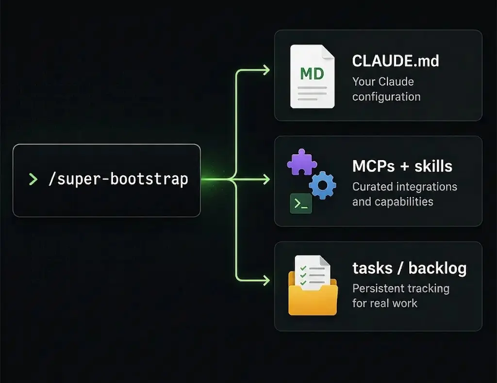

# super-bootstrap



Skip the per-project Claude setup grind. One command picks your skills, writes `CLAUDE.md`, pins your config, **and gives Claude a phase-gated workflow** — every session runs the pipeline, but only the phases the work actually needs. Workflow, not just a toolbelt. The harness names disciplines, not skills, so it does not marry you to any one process-harness plugin.

## Best for

Solo devs juggling multiple repos — agentic builders, not just coders. The harness carries
product context (problem, user, gap cards) alongside the engineering pipeline, because a
codebase answers *solution* only.

## Install

In Claude Code:

```
/plugin marketplace add rockyhong/super-bootstrap
/plugin install super-bootstrap@super-bootstrap
```

## Use

```
/super-bootstrap
```

One command per repo. Auto-routes:

The runway installs or syncs first either way — no product Q&A at any point. What follows depends on whether the seed docs already carry product content:

- **Seed docs substantive** → curates skills / MCPs / hooks against the stack those docs already declare.
- **Seed docs unfilled (greenfield)** → seeds three GAP cards (overview, techstack, tech curation) and stops at the resolve gate; curation waits until the product is settled.

Picks are matched to your stack and labeled by trust signal (Anthropic-vetted / popular / fresh / unaudited).


```mermaid
flowchart TD
    entry(["/super-bootstrap"])
    entry --> runway["install / sync runway<br/>CLAUDE.md + skeleton docs + rules"]
    runway --> gate{"seed docs<br/>substantive?"}
    gate -->|yes| curate["curate skills / MCPs / hooks"]
    gate -->|no| cards["seed 3 GAP cards"]
    cards --> hold["resolve gate — fill<br/>overview + techstack, re-run"]
    curate --> done["harness live<br/>start building"]
```

Re-run any time — incremental, never overwrites your edits.

## How files are handled

| Path | Behavior |
|---|---|
| `CLAUDE.md` | **Layered** per-section — never overwritten. Diff shown before any write. |
| `.claude/settings.json` | **Merged** — adds `enabledPlugins` + `extraKnownMarketplaces`; your other settings preserved. |
| `docs/`, `.claude/rules/` | **Seeded** with new files from detected stack. User-grown content never touched on re-run. |
| `.claude/hooks/` | **Installed** by default — one hook asset: `commit-channel` (PreToolUse) confines raw `git commit` to the main-session commit door — worker subagents are routed back to `/super-bootstrap:commit`, which runs commit mechanics gateway-inline, runs a bundled link-integrity check every commit, and dispatches a cold doc-sync scan on a grep-gate hit and a premise-closure judge on a product-anchor hit. |
| `.claude/super-bootstrap-runway.json` | **Coverage receipt** — records the plugin version that scaffolded/synced this runway plus which sections that sync actually checked — compared, or proposed for insert (`covered` / `declined`). On re-run a stale or missing stamp — or a matching version with coverage gaps — forces a full drift re-check (no "looks current" skim). |
| `.env*`, `*.key`, `*credential*` | **Skipped** from scan entirely — never read, never written. |

Also bundles `/super-bootstrap:todo` (intent-filtered work board), `/super-bootstrap:log` (capture observations as work cards), `/super-bootstrap:commit` (session-isolated, doc-sync-gated), `/super-bootstrap:merge` (absorb feature branches; aborts + surfaces on conflict), and `/super-bootstrap:help` (index of installed user-invoke skills) — all namespaced under `super-bootstrap:` so plugin manager disambiguates collisions automatically. The `/super-bootstrap` entry stays bare (plugin-name == skill-name special case).

Optional bonus: `/super-bootstrap:release-init` — one-shot scaffolder. Detects project type (unity / tauri / node / ios-native / android-native / generic) and generates a tailored `/release` skill at `.claude/skills/release/SKILL.md` (project-level skill, bare invocation since it lives in the user's repo, not under this plugin's namespace). Run only on repos that ship versioned releases.

## Sources

| Tool | Role |
|---|---|
| [superpowers](https://github.com/obra/superpowers) | Optional process harness — an ordinary curation candidate, not pinned. The scaffolded CLAUDE.md names disciplines (root cause before fix, settle the design, write the sequence), so a harness like this one slots in without the harness knowing its name. |
| [andrej-karpathy-skills](https://github.com/forrestchang/andrej-karpathy-skills) | Core dep auto-pinned in `.claude/settings.json`. Scaffolded CLAUDE.md § Coding Principles takes its `karpathy-guidelines` skill as the default coding standard (think-before-coding, simplicity, surgical changes, goal-driven execution); the always-scaffolded `CODING_STANDARDS.md` starts headings-only and overrides it only as sections fill. |
| [claude-code-setup](https://claude.com/plugins/claude-code-setup) | Anthropic's plugin recommender — fast-path source if installed |
| [Anthropic plugin marketplace](https://claude.com/plugins) | Anthropic-vetted skills, MCPs, hooks, subagents |
| [modelcontextprotocol/registry](https://github.com/modelcontextprotocol/registry) | Official MCP discovery registry — indexes reference impls + community |
| [everything-claude-code (ECC)](https://github.com/affaan-m/everything-claude-code) | Component bundle (skills + agents + rules + hooks). Language-specific rules preferred over local skeletons. |
| [awesome-claude-skills](https://github.com/ComposioHQ/awesome-claude-skills) | Curated category index, strong on workflow / external-tools picks |
| [VoltAgent/awesome-agent-skills](https://github.com/VoltAgent/awesome-agent-skills) | 1000+ skills from official dev teams (Anthropic, Vercel, Stripe, Cloudflare) + community |

## License

MIT
