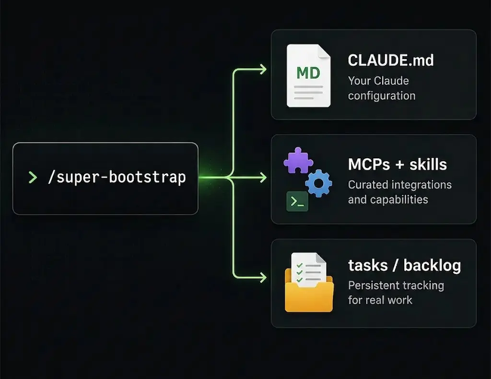
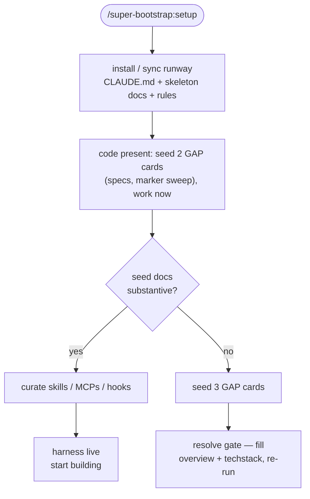

# super-bootstrap



Skip the per-project Claude setup grind. One command picks your skills, writes `CLAUDE.md`, pins your config, **and gives Claude a phase-gated workflow** — every session runs the pipeline, but only the phases the work actually needs. Workflow, not just a toolbelt. The harness [names disciplines, not skills](docs/specs/harness-architecture.md#6-decided-vs-open), so it does not marry you to any one process-harness plugin.

## Best for

Solo devs juggling multiple repos — agentic builders, not just coders. The harness carries
product context (problem, user, gap cards) alongside the engineering pipeline, because a
[codebase answers *solution* only](docs/overview.md#user).

## Install

In Claude Code:

```
/plugin marketplace add rockyhong/super-bootstrap
/plugin install super-bootstrap@super-bootstrap
```

### Cloud sessions

A cloud session (Claude Code on the web) loads none of the plugins a repo's `.claude/settings.json` declares — so the [core pin](docs/techstack.md#key-dependencies) `/super-bootstrap:setup` writes doesn't reach it, and `/plugin` isn't available there. Install the plugin from the cloud environment's setup script instead: on claude.ai/code, select the cloud icon above the message box, hover your environment, open its settings (gear), and put this in the **Setup script** field (not *Environment variables*):

```bash
#!/bin/bash
claude plugin marketplace add RockyHong/super-bootstrap || true
claude plugin install super-bootstrap@super-bootstrap || true
exit 0
```

The setup script belongs to the environment, not the repo — set it once and every repo opened in that environment gets the plugin. It runs only when a new session starts, so open a new session after saving.

## Use

```
/super-bootstrap:setup
```

One command per repo. Auto-routes:

The runway installs or syncs first either way — [no product Q&A at any point](docs/overview.md#problem). What follows depends on whether the seed docs already carry product content:

- **Code present** → first seeds two GAP cards (feature specs, code-marker sweep), commits them, and works what it can in the same run — an interrupted run leaves the cards for cold pickup.
- **Seed docs substantive** → curates skills / MCPs / hooks against the stack those docs already declare.
- **Seed docs unfilled (greenfield)** → seeds three GAP cards (overview, techstack, tech curation) and stops at the resolve gate; curation waits until the product is settled.

Picks are matched to your stack and labeled by trust signal (Anthropic-vetted / popular / fresh / unaudited).


```mermaid
flowchart TD
    entry(["/super-bootstrap:setup"])
    entry --> runway["install / sync runway<br/>CLAUDE.md + skeleton docs + rules"]
    runway --> code["code present: seed 2 GAP cards<br/>(specs, marker sweep), work now"]
    code --> gate{"seed docs<br/>substantive?"}
    gate -->|yes| curate["curate skills / MCPs / hooks"]
    gate -->|no| cards["seed 3 GAP cards"]
    cards --> hold["resolve gate — fill<br/>overview + techstack, re-run"]
    curate --> done["harness live<br/>start building"]
```

Re-run any time — incremental, never overwrites your edits; when the installed plugin has moved past the version your runway was last synced at, every session opens with a one-line advisory naming the re-run ([`runway-version`](plugins/super-bootstrap/hooks/runway-version.sh), a plugin-owned SessionStart hook — nothing placed in your repo). A re-run also retires consumer fork skills/agents the plugin now supersedes (per-deletion confirm) and backfills runway sections added since the last sync; stack facts (the `CLAUDE.md` Tech Stack line, `docs/techstack.md`'s Runtime / Framework / Key Dependencies / Build & Distribution) are seeded once — a re-run after code first arrives flags them stale for a hand refresh, never rewrites them. A workspace manifest (`pnpm-workspace.yaml`, `turbo.json`, …) switches on the monorepo tier — rules and build pre-flight fan out per package. Repos whose card set outgrows one flat list can opt into the scale module (`docs/parked.md` + `docs/test-queue.md` + `docs/outward/`) — offered only once earned, never by default.

## How files are handled

| Path | Behavior |
|---|---|
| `CLAUDE.md` | **Layered** per-section — never overwritten. Diff shown before any write. |
| `.claude/settings.json` | **Merged** — adds `enabledPlugins` + `extraKnownMarketplaces` for the [core self-pin](docs/techstack.md#key-dependencies); your other settings preserved. |
| `CODING_STANDARDS.md` | **Seeded** headings-only at the repo root when the repo has code — your repo's binding conventions, read at every code touch; a docs-only repo (no manifest, no source file) takes neither the file nor the CLAUDE.md § Coding Principles slot until code arrives. Preamble + section headings drift-checked on re-run; section content is yours, hand-recorded when a review or commit settles a convention (this file sits outside the doc-sync surface). |
| `AGENTS.md` | **Seeded** at the repo root on every bootstrap, code or not — the standing contract a foreign build executor (`codex exec` or equivalent) reads on a build task here, whether the gateway dispatched it or you started it yourself: ground in the docs, report built + file list, never commit, narrative docs and work cards stay the orchestrator's. Started directly, with no orchestrator downstream, it hands that list back to you rather than dropping it. Shipped body drift-checked on re-run; anything you append below it is yours. |
| `docs/`, `.claude/rules/` | **Seeded** with new files from detected stack. User-grown content never touched on re-run. |
| `.claude/hooks/` | **Installed** by default — three hook assets: `commit-channel` (PreToolUse, on both the Bash and PowerShell tools) confines raw `git commit` to the main-session commit door — worker subagents are routed back to `/super-bootstrap:commit`, which runs commit mechanics and the doc-sync judgment gateway-inline, runs two bundled whole-surface checks every commit — link integrity, and restated agent model pins against their frontmatter — and dispatches a cold doc-sync scan only past the scope ceiling and a premise-closure judge on a product-anchor hit. The `consult-check` pair (SessionStart + UserPromptSubmit) derives a compact `docs/**` catalog once per session and injects a forced per-doc relevance evaluation at every prompt — the read boundary's activation layer. |
| `.claude/super-bootstrap-runway.json` | **Coverage receipt** — records the plugin version that scaffolded/synced this runway plus what that sync actually checked — the sections and whole-file artifacts it compared or proposed for insert, and the renamed-away literals its rot scan raised (`covered` / `declined`; each declined row carries [the one-line reason given when it was declined](plugins/super-bootstrap/skills/harness-bootstrap/SKILL.md#2c-sync-report--commit), read back beside the row on the next re-run) — and, per frozen file asset it placed or verified current, the sha256 of the asset (`placed`), so a later sync can tell a lagging copy from a consumer-edited one. On re-run a stale or missing stamp — or a matching version with coverage gaps — forces a full drift re-check (no "looks current" skim). |
| `.env*`, `*.key`, `*credential*` | **Skipped** from scan entirely — never read, never written. |

## Day to day

The runway's doors are bundled skills — all namespaced `super-bootstrap:`, entry included: `/super-bootstrap:setup`. Work enters as a card in `docs/work/` ([`BUG` / `DEBT` / `GAP`](docs/work/README.md#categories)) and runs one envelope — ground → implement → verify → doc-sync → commit — with only the phases the card's shape needs. Most doors Claude reaches on its own; you type five daily, two when the moment calls.

**You type**

| Door | Role |
|---|---|
| `/super-bootstrap:log <observation>` | Capture — writes a card; feature ideas log as `GAP` beside defects. Suspected duplicates surface for your pick, never auto-merge. |
| `/super-bootstrap:needs-me` | What deserves your attention — cuts the open work into lenses that exist in your repo right now, asks which, recommends up to five items with why they need you. Session opener for design / decision work. |
| `/super-bootstrap:session-close` | At a session boundary — done-close clears your carry; park-close appends a `## Progress` block to the card and writes only the rest to the `SESSION-STATE/` ledger. Every closeout move (commit through the commit door, push, card resolve, prune) runs through one confirm-pick. |
| `/super-bootstrap:session-continue` | Session opener for resuming — reads the `SESSION-STATE/` ledger, claims the carry you pick, reads its card's latest block of each type, confirms the next step. No carry → hands off to `needs-me`. |
| `/super-bootstrap:help` | Index of installed user-invoke skills, grouped by category. |
| `/super-bootstrap:autorun` | Runs the cards that need no one — one isolated git worktree + headless `claude -p` per card, each running the whole card to done; walls come back as one sheet with resolve / park / drop. User-only by design. |
| `/super-bootstrap:merge` | When feature branches are ready — absorbs them; aborts + surfaces the file list on conflict. |

**Claude runs** — reached by the pipeline, not typed (typing them works; you rarely need to)

| Door | When |
|---|---|
| `/super-bootstrap:triage {ID}` | Every card pickup — a cold, read-only subagent verifies the card's premise and appends a Verdict block; no code changes. |
| `/super-bootstrap:commit` | End of every cycle — session-isolated (never `-A`; staged set read back against the session list before `git commit`), link-integrity and model-pin checks every commit, doc-sync judged warm gateway-inline on a [mechanical gate hit](plugins/super-bootstrap/skills/commit/SKILL.md) (cold scan dispatch only past the scope ceiling). The `commit-channel` hook routes a worker subagent's raw `git commit` back here. |
| `/super-bootstrap:triage-report` | When a scan report lands in `.review/` — per-finding promote / patch / dup / investigate / dismiss. |

Per-skill contract = that skill's `SKILL.md` frontmatter; one-line index in the [plugin README](plugins/super-bootstrap/README.md#skill-catalog); pipeline shape in [`docs/overview.md` § Data Flow](docs/overview.md#data-flow).

## Occasional

Not day-to-day — run when the moment calls:

- `/super-bootstrap:check-docs-consistency` — whole-surface doc drift scan, timestamped report to `.review/`, report-only; the commit door's scoped scan covers the everyday case. User-only by design.
- `/super-bootstrap:resolve-plugins` — standalone refresh of the curated skill / MCP / hook pins (the same curation `/super-bootstrap:setup` runs as tier 2). Reads your stack from `docs/techstack.md` and stops with a pointer to `/super-bootstrap:harness-bootstrap` when that file isn't there yet.
- `/super-bootstrap:release-init` — one-shot scaffolder. Detects project type (unity / tauri / node / ios-native / android-native / generic) and generates a tailored `/release` skill at `.claude/skills/release/SKILL.md` (project-level skill, bare invocation since it lives in the user's repo, not under this plugin's namespace). Run only on repos that ship versioned releases.

## Sources

| Tool | Role |
|---|---|
| [superpowers](https://github.com/obra/superpowers) | Process harness — an ordinary curation candidate, never pinned. The scaffolded CLAUDE.md names disciplines (root cause before fix, settle the design, write the sequence), so any harness slots in without the harness knowing its name. |
| [claude-code-setup](https://claude.com/plugins/claude-code-setup) | Anthropic's plugin recommender — fast-path source if installed |
| [Anthropic plugin marketplace](https://claude.com/plugins) | Anthropic-vetted skills, MCPs, hooks, subagents |
| [modelcontextprotocol/registry](https://github.com/modelcontextprotocol/registry) | Official MCP discovery registry — indexes reference impls + community |
| [everything-claude-code (ECC)](https://github.com/affaan-m/everything-claude-code) | Component bundle (skills + agents + rules + hooks). Language-specific rules preferred over local skeletons. |
| [awesome-claude-skills](https://github.com/ComposioHQ/awesome-claude-skills) | Curated category index, strong on workflow / external-tools picks |
| [VoltAgent/awesome-agent-skills](https://github.com/VoltAgent/awesome-agent-skills) | Skills from official dev teams (Anthropic, Vercel, Stripe, Cloudflare) + community |

## License

MIT
